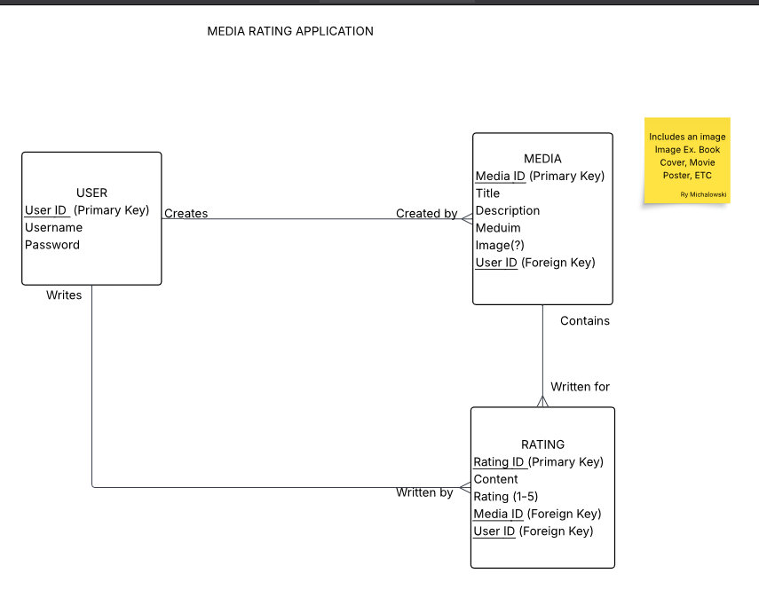

# Project Description 

## Media Rating Application 

### What is the purpose of this app?
#### The purpose of this app is to allow users to rate a chosen piece of media on a rating system of 1 star out of 5. Users will submit their rating in the form of a post including an: image attachment of the peice of media, rating out of 5, comment/description of the rating. 

### Who is this intended for?
#### The intended user base consists of individuals who wish to share and record their ratings of various pieces of media both for personal tracking, and for showing friends. 

### What actions will users be able to perform?
#### Users will have the ability to: sign up, add images, create posts, share posts with other users, select a rating from 1 to 5 stars.

